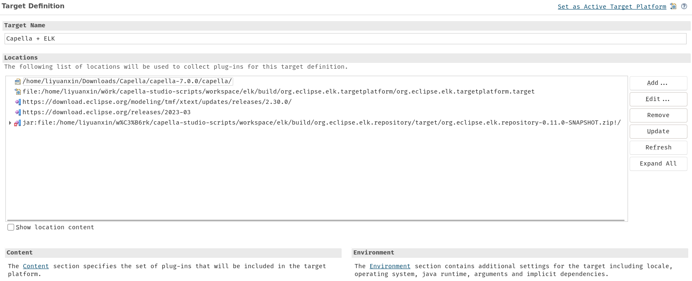
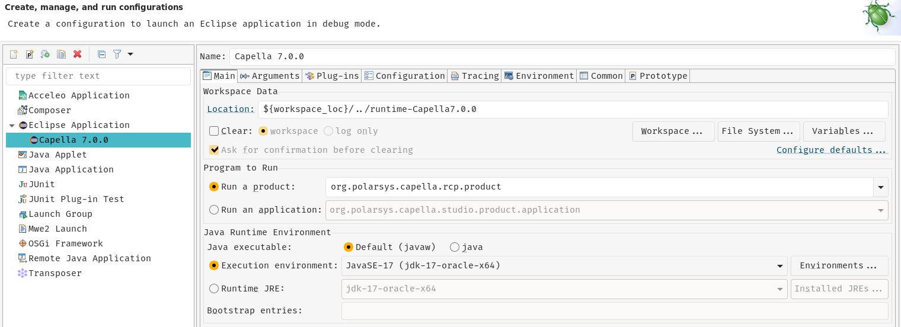
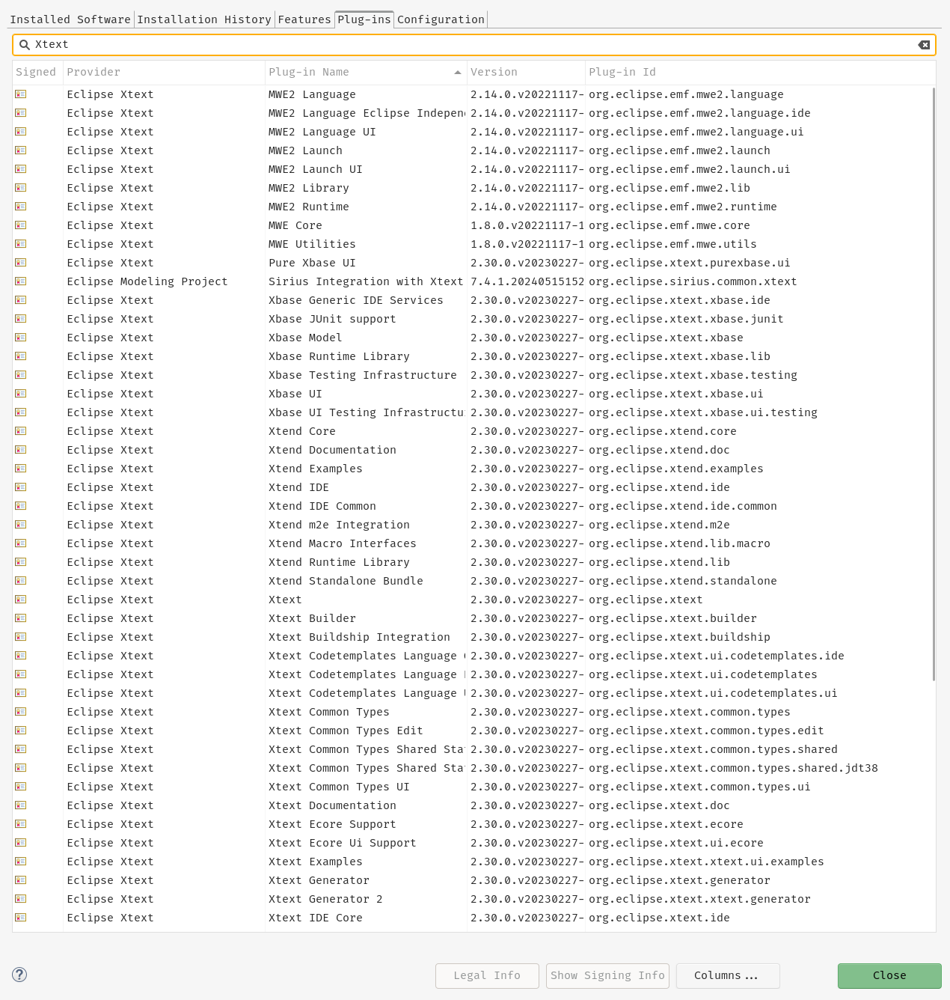
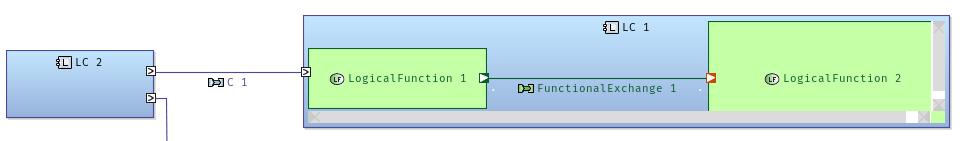
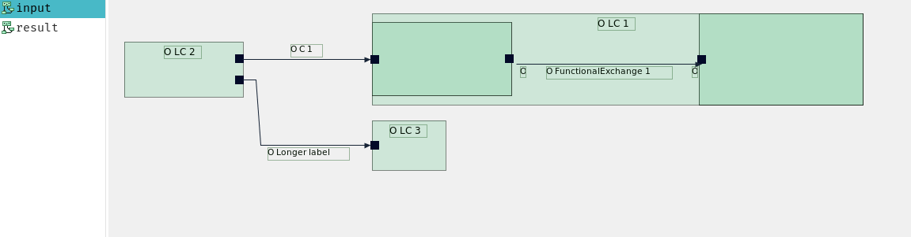
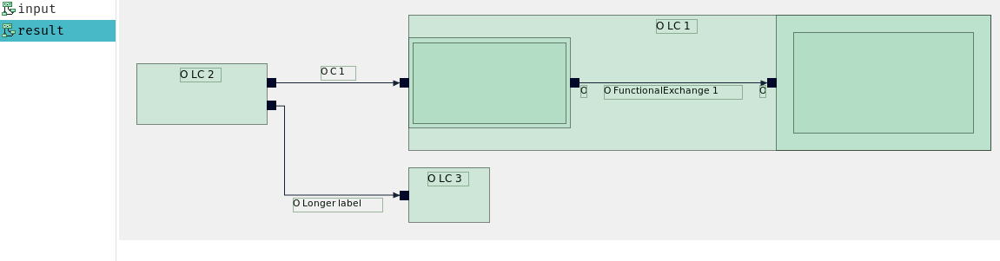
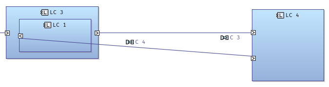
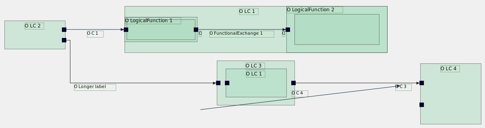

## Debug with Capella Studio 7.0.0
Overview of Environment:
OS version (ubuntu 22.04 LTS)
Capella Studio version (capella-studio-7.0.0.202407171300-linux.gtk.x86_64)
Java version (elk only allows >=jdk 17)
Maven version (3.9.9)

Current debugging setup with Capella Studio 7.0.0 Capella Studio does not
provide a fully functional debug shell for executing expressions or Java code
live (i.e., like a REPL). However, variables and instances can still be
inspected.

How to set it up:

To build the whole ELK plugin as an update site archive (ZIP) you can do the
following:

```bash
mvn -e \
  --define elk.metadata.documentation.outputPath=$PWD/../docs \
  -Dmaven.repo.local=./mvnrepo -Dtycho.disableMavenVersionCheck=true \
  package
```

this is taken from here:
https://eclipse.dev/elk/documentation/contributors/buildingelk.html

The -Dtycho.disableMavenVersionCheck=true flag bypasses a bug that enforces
Maven 3.9.0. The build was successful using Maven 3.9.9.

Now define a target for ELK and Capella like this:



and for the debug configuration:



You can now set breakpoints in ELK .java files via the UI and step through the
code. I never had to build the ELK plugin again and reinstall it in Capella
again.

### Requirements for Capella 7.0.0 for debugging ELK plugin
ELK has dependencies:
- Google Gson (2.10 provided as a drop in)
- Google Inject (3.0.0 provided as a drop in)
- Xtext 2.30 works (this can just be installed through update site:
  https://download.eclipse.org/modeling/tmf/xtext/updates/composite/releases/)
  Installation is cumbersome due to an incompatible Eclipse runtime version.

Installed Xtext that works:



To check if dependencies are solved, install ELK from the ZIP once. The Eclipse
wizard will indicate missing dependencies during installation.

### Checklist
[ ] Setup local ELK build with Maven
[ ] Import ELK source into Capella Studio
[ ] Define Capella + ELK Target
[ ] Define debug configuration for Capella 7.0.0
[ ] Meet all ELK requirements in Capella 7.0.0
[ ] Place a breakpoint in GmfDiagramLayoutConnector.java
[ ] Validate that the process is halted at the breakpoint

## Bug list
### No labels handled on nodes and edges (partially solved)
In order for ELK to calculate correct sizes for nodes and route edges with
enough space, labels must allocate sufficient space for both text and a 16x16
icon (if applicable).

- Solved for edges
- Solved for Components
- Not solved for Ports
- Not solved for Functions

### Sizing in hierarchical case
When components are nested or functions allocated the parent box gets resized
by ELK. But the space is not enough, scrollbars appear:



Padding does not resolve the issue. Applying padding to functions (or all boxes
by default in `Layered.melk`) causes infinite size growth on repeated ELK
layout executions. Definitely not wanted.

 

Either padding isn't working correctly in ELK or it is really meant to grow the
node this config is set on. The ports are attached on the node (LNode)
including the padding in its size. If this isn't how padding should work then,
the padding needs to be removed somewhen when the port is attached and from the
above pictures it is apparent that the borderOffset is also missing. ***Padding
should act as a temporary size addition, which is removed from the ELK node
size after node positioning is finalized.***

### Port borderOffset present from defaults on the result
Fixed the retrieval of the port borderOffset property from the default
configuration (`Layered.melk`). This property appears inconsistently applied to
the resulting ELK graph. Not sure if this is buggy or working.

Working borderOffset is very important for orthogonal routing of edges to work.

### Hierarchical Edges are not handled
Hierarchical edges are edges that leave their level(graph). For elk to be able
to correctly route edges orthogonally edges contained in a node need to be
identified as such and assigned to the elknode.



Edge `C4` should be identified as a global edge. While its representation in
JSON (as handled by ELKJS) is known, the corresponding handling in the Java
codebase is unclear. I think ELK is using the following algorithm to determine
if an edge needs to be defined globally or is contained in a node:

The algorithm likely identifies the highest common owner (HCO) of the edge's
source and target. If the HCO is a node, the edge is local to it (contained);
if it's a graph, the edge is considered global (contained in the graph).

The bug: Hierarchical edges currently appear to be entirely unhandled.



### Testing of bug fixes

It is wise to test the fixes on a simple graph (without hierarchy). Then test
progressively more complex hierarchical cases, such as those shown above.

## Task at the end
### Sharing working development setup
Please document any improvements to the development/debugging setup of the ELK
plugin in this document. Do this in a way that allows external developers to
contribute fixes and enhancements efficiently. This includes the expected IDE,
target platform, project import strategy and typical debugging workflow.
